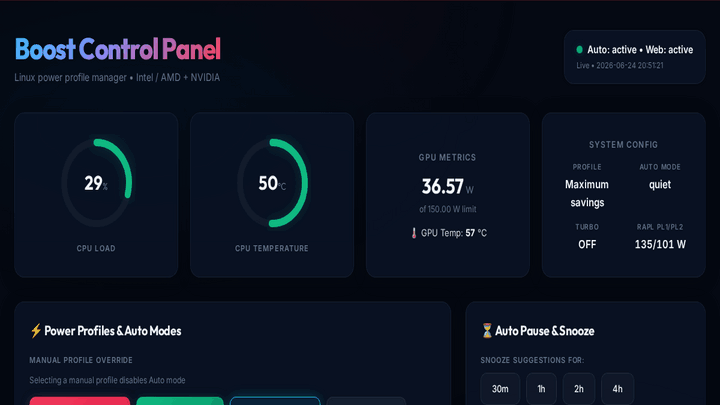
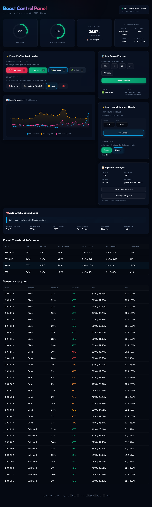
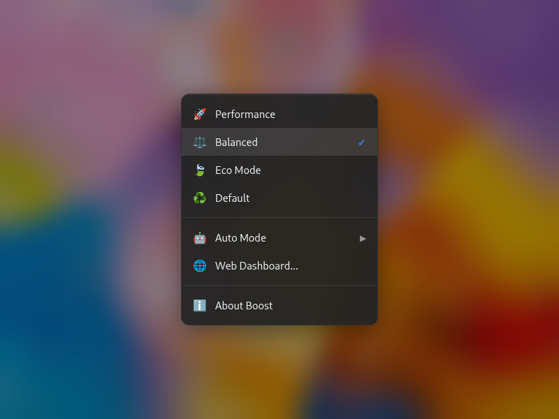

<div align="center">
  <br/>

  # ⚡ Boost
  **Intelligent, premium Linux power management for Intel + AMD + NVIDIA desktops.**

  [](LICENSE)
  [](https://github.com/horiastanxd/boost/actions/workflows/shellcheck.yml)
  [](lib/boost-web.py)
  [](bin/boost)
  [](https://kernel.org)

  *Manual profiles, autonomous smart modes, and a gorgeous local web dashboard. Fully reversible.*<br/>
  **GNOME Power Mode indicator stays in sync automatically.**

  
</div>

<br/>

---

## 🌟 Why Boost?

Most Linux desktops run at full BIOS power limits all the time. On modern hardware like the i7-14700K, this means thermal spikes, unnecessary fan noise, and idle temperatures up to **89°C** just from context switching.

**Boost** brings intelligent, premium power management to your Linux desktop — per-use-case control over CPU governor, EPP, RAPL power limits, GPU wattage, I/O scheduler, and fan curves. Safely and reversibly.

### 📉 Real-World Results
Tested on **i7-14700KF + RTX 5060 Ti** on Ubuntu 24.04 (one case fan):

| Profile | Package Temp | Fan Noise | PL1 (Sustained) | PL2 (Burst) | GPU Limit |
|---------|-------------|-----------|-----------------|-------------|-----------|
| 🔴 **BIOS default** | **89°C** | 🌪️ Loud | 135 W | 253 W | 180 W |
| 🚀 **Performance** | 63°C | 💨 Moderate | 125 W | 253 W | 180 W |
| ⚖️ **Balanced** | 54°C | 🤫 Quiet | 125 W | 150 W | 150 W |
| 🍃 **Eco Mode** | **~50°C** | 🪶 Near-silent | 65 W | 75 W | 150 W |

*A 35°C drop purely through smart software. No undervolting required.*

---

## 🆚 How Boost Compares

| Feature | **Boost** | TLP | auto-cpufreq | powertop |
|---------|-----------|-----|--------------|---------|
| Web dashboard | ✅ | ❌ | ❌ | ❌ |
| Live telemetry chart | ✅ | ❌ | ❌ | ❌ |
| System tray applet | ✅ | ❌ | ❌ | ❌ |
| Game mode auto-detect | ✅ | ❌ | ❌ | ❌ |
| Desktop notifications | ✅ | ❌ | ✅ | ❌ |
| GNOME Power sync | ✅ | ❌ | ✅ | ❌ |
| RAPL power limits | ✅ | ✅ | ❌ | ✅ |
| GPU power limits | ✅ | ❌ | ❌ | ❌ |
| Per-use-case profiles | ✅ | ❌ | ❌ | ❌ |
| Fully reversible | ✅ | ✅ | ✅ | ✅ |

---

## 🖥️ Hardware Compatibility

| Component | Status | Notes |
|-----------|--------|-------|
| Intel CPU (RAPL PL1/PL2) | ✅ Full | Tested on 10th-14th gen |
| AMD CPU (governor + EPP) | ✅ Full | Ryzen 5000/7000 series |
| NVIDIA GPU (power limits) | ✅ Full | Requires `nvidia-smi` |
| AMD GPU (power limits) | ✅ Full | Requires `amdgpu` driver (v1.3.0+) |
| Intel Arc GPU | 🔜 Planned | No upstream power limit interface yet |
| Laptop / battery | 🔜 Planned | AC event trigger exists; battery profiles coming |

---

## 🚀 Quick Start

**One line install:**
```bash
curl -fsSL https://raw.githubusercontent.com/horiastanxd/boost/main/install.sh | sudo bash
```

Or manually:
```bash
git clone https://github.com/horiastanxd/boost
cd boost
sudo ./install.sh
```

**Core Commands:**
```bash
powersave        # ⚖️ Balanced — Good for 95% of daily use
boost            # 🚀 Performance — Switch when you need full power
silent           # 🍃 Eco Mode — Tonight, before you sleep
restore          # ♻️ Default — Back to BIOS defaults anytime

auto setup       # ⚙️ Guided setup for Smart Auto Modes
auto web         # 🌐 Open realtime web controls
auto doctor      # 🩺 Check if sensors and drivers work
```
*All commands auto-elevate via `sudo` — no need to prefix them.*

---

## ⚙️ How It Works

```
┌─────────────────────────────────────────────────┐
│  CLI commands      │  Web Dashboard  │  Tray     │
│  boost / powersave │  localhost:8765 │  systray  │
└──────────┬─────────┴────────┬────────┴──────────┘
           │                  │
           ▼                  ▼
┌──────────────────────────────────────────────────┐
│  power-common.sh  — applies CPU + GPU limits      │
│  • Intel RAPL PL1/PL2     • NVIDIA/AMD GPU watt  │
│  • CPU governor + EPP     • I/O scheduler         │
│  • power-profiles-daemon (GNOME sync)             │
└──────────────────────────────────────────────────┘
           │
           ▼
┌──────────────────────────────────────────────────┐
│  boost-daemon.py  — monitors and adapts          │
│  • Polls CPU temp + load every 5s                │
│  • Detects games, creator workloads, meetings    │
│  • Sends desktop notifications with actions      │
│  • Records stats CSV for history chart           │
└──────────────────────────────────────────────────┘
```

---

## 🎨 Premium Interfaces

### 🖥️ The Web Dashboard
A sleek, realtime, glassmorphic local dashboard. Change profiles, tweak smart modes, and view live telemetry at `http://localhost:8765`.



### 💧 The System Tray Applet
Fast, seamless profile switching right from your desktop environment panel.



---

## ❓ FAQ

**Q: Does Boost work without an NVIDIA GPU?**  
Yes. GPU management is skipped gracefully. AMD GPU support added in v1.3.0 via `amdgpu` driver.

**Q: Will Boost conflict with TLP or auto-cpufreq?**  
Yes - running multiple power managers simultaneously causes conflicts. Disable TLP/auto-cpufreq before using Boost.

**Q: Can I use Boost on a laptop?**  
Partially. Profile switching works. Battery-aware profiles are planned. AC event trigger already fires when you plug/unplug.

**Q: How do I undo everything?**  
Run `restore` to return to BIOS defaults, then `sudo ./uninstall.sh` to remove all files.

**Q: The tray applet doesn't appear.**  
Install `gir1.2-ayatanaappindicator3-0.1` (Ubuntu/Debian) or `libayatana-appindicator3` (Fedora/Arch). Then run `boost-tray &`.

---

## 🤖 Smart Auto Modes

Manual control is great, but autonomous logic is better. `boost-auto` runs a lightweight Python daemon that monitors your thermal and load states every 5 seconds. Instead of tweaking numbers, select a persona that matches your workflow:

- 🧠 **Dynamic (Default)**: Adapts to everyday workloads. Automatically limits spikes during idle usage but prompts you for Boost if heavy load persists.
- 🎮 **Gaming**: Auto-detects game processes (Steam, Wine, CS2, Dota2...) and switches to Performance instantly. Respects thermal safety.
- 🎬 **Creator**: Designed for 3D rendering and AI training. Prioritizes maximum thermal limits, holding performance states much longer.
- 🤫 **Quiet**: Perfect for libraries, meetings, or overnight. Enforces strict thermal/noise ceilings.

```bash
auto mode dynamic    # Enable everyday balanced suggestions
auto mode gaming     # Enable gaming optimizations
auto mode creator    # Enable AI/rendering constraints
auto mode quiet      # Enable strict thermal constraints
```

---

## ⚙️ Requirements

| Component | Requirement |
|-----------|-------------|
| CPU driver | `intel_pstate` (Intel 6th gen+) or `amd_pstate` (Zen 2+) |
| GPU | NVIDIA with `nvidia-smi` *(optional)* |
| GNOME sync | `power-profiles-daemon` + `powerprofilesctl` *(optional)* |
| Fan control | `nct6798` or compatible SuperIO *(optional)* |
| Privileges | sudo |

Check your compatibility in one line:
```bash
cat /sys/devices/system/cpu/cpu0/cpufreq/scaling_driver  # expects intel_pstate or amd_pstate
nvidia-smi -L                                             # expects GPU list
ls /sys/class/powercap/intel-rapl/                        # expects RAPL available
```

> **AMD users:** RAPL and fan control work identically. `amd_pstate` governor/EPP logic is supported. Pull requests welcome!

---

## 🛡️ Safety & Architecture

- **RAPL Bounds Checking:** Every power limit modification reads the `constraint_*_max_power_uw` from your CPU and clamps values *before* writing.
- **Hardware Fan Authority:** Eco Mode shifts the Smart Fan IV PWM curve, but the motherboard retains ultimate thermal authority. If the CPU reaches 75°C+, fans blast to 100% regardless.
- **Boot Persistence:** Profile changes are ephemeral by default. A `systemd` service (`power-save-originals.service`) captures your BIOS state at boot — `restore` always works, reboot always resets to factory defaults.
- **Thread-safe daemon:** The Python web server and background daemon are fully thread-safe with proper lock guards on all shared state.

---

## 🗑️ Uninstall

Reverting is easy and leaves no trace:
```bash
sudo ./uninstall.sh
```

The uninstaller restores BIOS power defaults first, then removes all binaries, systemd units, udev rules, desktop entries, and the state directory. Your `/etc/boost-auto.conf` is kept unless you choose to delete it.

---

<div align="center">
  <br/>
  Made with ❤️ by <a href="https://github.com/horiastanxd">Horia Stan</a>. Licensed under MIT.<br/>
  <i>If this saved your CPU from thermal hell, consider leaving a ⭐</i>
</div>
