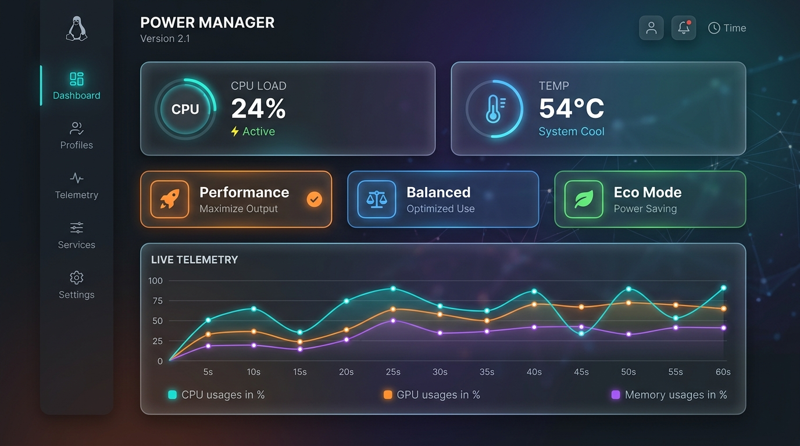
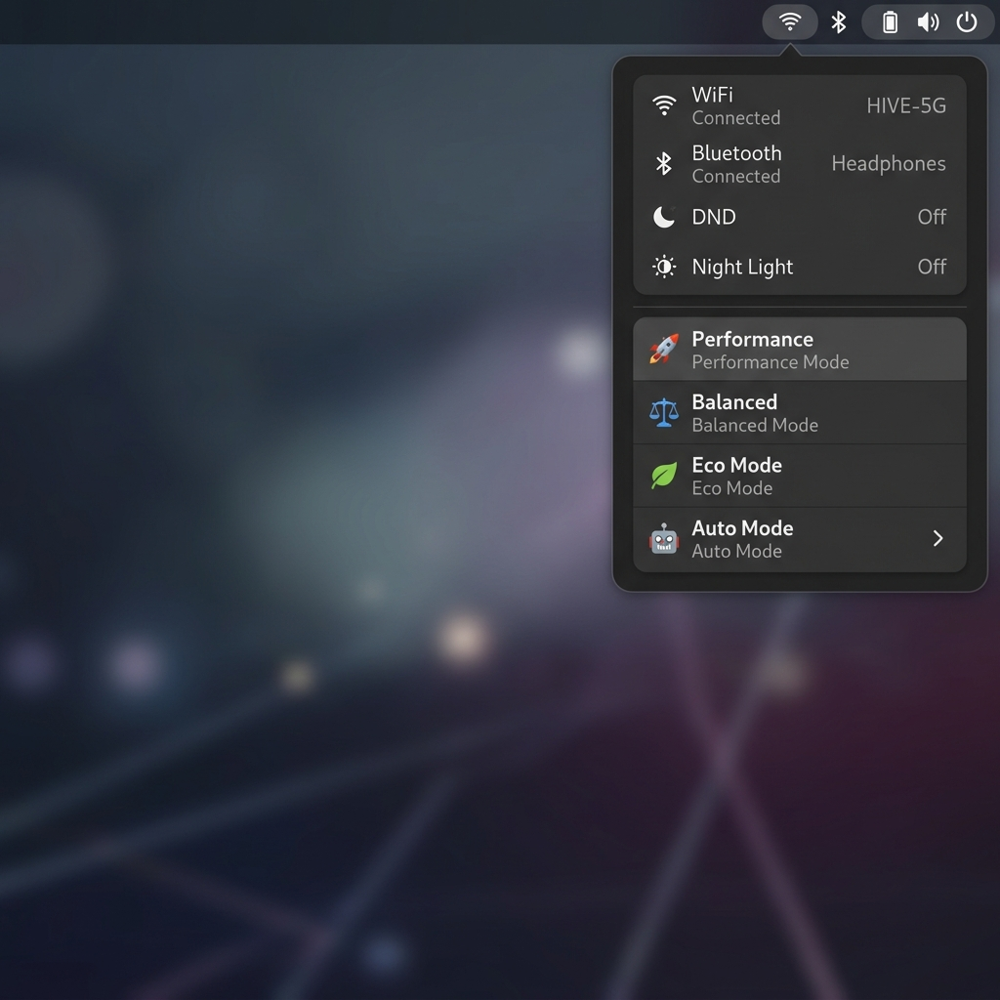

<div align="center">
  
  
  <br/>
  
  # ⚡ Boost
  **Intelligent, premium Linux power management for Intel + NVIDIA desktops.**

  [](LICENSE)
  [](https://github.com/horiastanxd/boost/actions/workflows/shellcheck.yml)
  [](bin/boost)
  [](https://kernel.org)

  *Manual profiles, autonomous smart modes, and a gorgeous local web dashboard. Fully reversible.*<br/>
  **GNOME Power Mode indicator stays in sync automatically.**
</div>

<br/>

---

## 🌟 The Ultimate Linux Power Experience
Most Linux desktops run at full BIOS power limits all the time. On modern hardware like the i7-14700K, this means thermal spikes, unnecessary fan noise, and high idle temperatures reaching up to 89°C just from context switching. 

**Boost** brings intelligent, premium power management to your Linux desktop. It offers per-use-case control over the CPU governor, energy performance hints (EPP), RAPL power limits, GPU wattage, I/O scheduler, and fan curves — safely and reversibly.

### 📉 Real-World Results
Tested on an **i7-14700KF + RTX 5060 Ti** on Ubuntu 24.04 (one case fan):

| Profile | Package Temp | Fan Noise | PL1 (Sustained) | PL2 (Burst) | GPU Limit |
|---------|-------------|-----------|-----|-----|-------|
| 🔴 **BIOS default** | **89°C** | 🌪️ Loud | 135 W | 253 W | 180 W |
| 🚀 **Performance** | 63°C | 💨 Moderate | 125 W | 253 W | 180 W |
| ⚖️ **Balanced** | 54°C | 🤫 Quiet | 125 W | 150 W | 150 W |
| 🍃 **Eco Mode** | **~50°C** | 🪶 Near-silent | 65 W | 75 W | 150 W |

*A 35°C drop purely through smart software algorithms. No undervolting required.*

---

## 🎨 Premium Interfaces
We believe system tools should be beautiful. Boost comes with two stunning, modern ways to control your machine:

### 🖥️ The Web Dashboard
A sleek, realtime, glassmorphic local dashboard. Change profiles, tweak smart modes, and view live telemetry (CPU, GPU, RAM) at `http://localhost:8765`.


### 💧 The System Tray Applet
Fast, seamless profile switching right from your desktop environment panel.


---

## 🛠️ Quick Start

```bash
git clone https://github.com/horiastanxd/boost
cd boost
sudo ./install.sh
```

**Core Commands:**
```bash
powersave        # ⚖️ Balanced — Good for 95% of daily use
boost            # 🚀 Performance — Switch when you need full power
silent           # 🍃 Eco Mode — Tonight, before you sleep
restore          # ♻️ Default — Back to BIOS defaults anytime

auto setup       # ⚙️ Guided setup for Smart Auto Modes
auto web         # 🌐 Open realtime web controls
auto doctor      # 🩺 Check if sensors and drivers work
```
*All commands auto-elevate via `sudo` — no need to prefix them.*

---

## 🤖 Smart Auto Modes (Personas)
Manual control is great, but autonomous logic is better. `boost-auto` runs a lightweight daemon that monitors your thermal and load states every 5 seconds. Instead of tweaking numbers, select a persona that matches your workflow:

- 🧠 **Dynamic (Default)**: Adapts to everyday workloads. Automatically limits spikes during idle usage but prompts you for Boost if heavy load persists.
- 🎬 **Creator**: Designed for gaming, 3D rendering, and AI training. Prioritizes maximum thermal limits, holding performance states for much longer without interruption.
- 🤫 **Quiet**: Perfect for libraries, meetings, or leaving the PC on overnight. Enforces strict thermal/noise ceilings and restricts sudden bursts of power.

```bash
auto mode dynamic    # Enable everyday balanced suggestions
auto mode creator    # Enable gaming/rendering optimizations
auto mode quiet      # Enable strict thermal constraints
```

---

## ⚙️ Requirements
Boost relies on standard Linux power APIs to orchestrate its magic:

| Component | Requirement |
|-----------|-------------|
| CPU driver | `intel_pstate` (Intel 6th gen+) |
| GPU | NVIDIA with `nvidia-smi` |
| GNOME sync | `power-profiles-daemon` + `powerprofilesctl` *(auto-detected, optional)* |
| Fan control | `nct6798` or compatible SuperIO *(optional)* |
| Privileges | sudo |

Check your compatibility in one line:
```bash
cat /sys/devices/system/cpu/cpu0/cpufreq/scaling_driver  # expects intel_pstate
nvidia-smi -L                                             # expects GPU list
ls /sys/class/powercap/intel-rapl/                        # expects RAPL available
```

> **AMD users:** RAPL and fan control work identically. Replace governor/EPP logic with `amd_pstate` equivalents. Pull requests are highly welcome!

---

## 🛡️ Safety & Architecture
We don't mess around with hardware safety. 

- **RAPL Bounds Checking:** Every power limit modification reads the `constraint_*_max_power_uw` from your CPU and clamps values *before* writing.
- **Hardware Fan Authority:** The `Eco Mode` (silent) shifts the Smart Fan IV PWM curve, but the motherboard retains ultimate thermal authority. If the CPU reaches 75°C+, the fans will blast to 100% regardless of the software curve.
- **Boot Persistence:** Profile changes are ephemeral by default. A dedicated `systemd` service (`power-save-originals.service`) captures your BIOS state at boot, ensuring `restore` always works and a reboot always resets your system to factory defaults.

---

## 🗑️ Uninstall
Reverting is easy and leaves no trace behind:
```bash
sudo rm /usr/local/bin/{boost,powersave,silent,restore,power-save-originals,summer,auto,power-report,boost-web}
sudo rm /usr/local/lib/power-common.sh
sudo rm /usr/local/lib/boost-web.py
sudo systemctl disable --now power-save-originals.service boost-auto.service boost-web.service
sudo rm /etc/systemd/system/{power-save-originals,boost-auto,boost-web}.service
sudo rm -rf /var/lib/power-profile
```

---

<div align="center">
  <br/>
  Made with ❤️ by <a href="https://github.com/horiastanxd">Horia Stan</a>. Licensed under MIT.<br/>
  <i>If this saved your CPU from thermal hell, consider leaving a ⭐</i>
</div>
