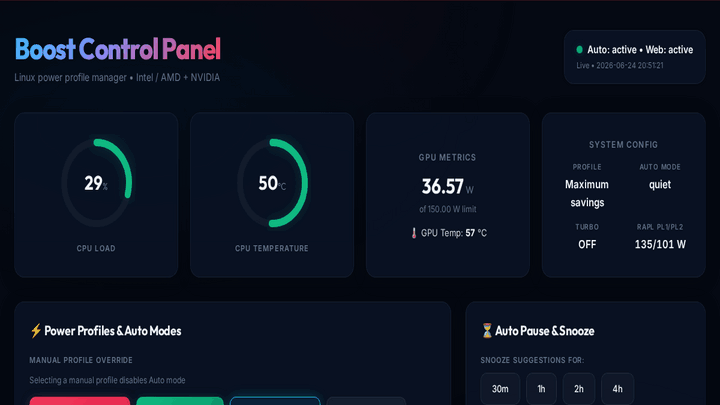
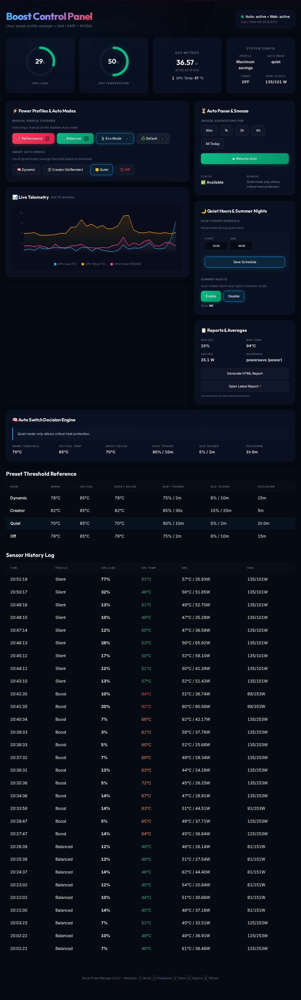
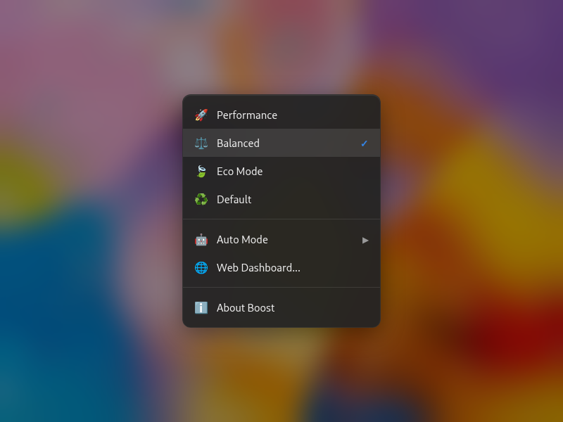

<div align="center">
  <br/>

  # ⚡ Boost
  **Intelligent, premium Linux power management for Intel, AMD, NVIDIA, and Fedora Asahi systems.**

  [](LICENSE)
  [](https://github.com/horiastanxd/boost/actions/workflows/shellcheck.yml)
  [](lib/boost-web.py)
  [](bin/boost)
  [](https://kernel.org)

  *Manual profiles, autonomous smart modes, and a gorgeous local web dashboard. Fully reversible.*<br/>
  **GNOME Power Mode indicator stays in sync automatically.**

  
</div>

<br/>

---

## 🌟 Why Boost?

Most Linux desktops run at full BIOS power limits all the time. On modern hardware like the i7-14700K, this means thermal spikes, unnecessary fan noise, and idle temperatures up to **89°C** just from context switching.

**Boost** brings intelligent, premium power management to your Linux desktop — per-use-case control over CPU governor, EPP, RAPL power limits, GPU wattage, I/O scheduler, and fan curves. Safely and reversibly.

### 📉 Real-World Results
Tested on **i7-14700KF + RTX 5060 Ti** on Ubuntu 24.04 (one case fan):

| Profile | Package Temp | Fan Noise | PL1 (Sustained) | PL2 (Burst) | GPU Limit |
|---------|-------------|-----------|-----------------|-------------|-----------|
| 🔴 **BIOS default** | **89°C** | 🌪️ Loud | 135 W | 253 W | 180 W |
| 🚀 **Performance** | 63°C | 💨 Moderate | 125 W | 253 W | 180 W |
| ⚖️ **Balanced** | 54°C | 🤫 Quiet | 125 W | 150 W | 150 W |
| 🍃 **Eco Mode** | **~50°C** | 🪶 Near-silent | 65 W | 75 W | 150 W |

*A 35°C drop purely through smart software. No undervolting required.*

---

## 🆚 How Boost Compares

| Feature | **Boost** | TLP | auto-cpufreq | powertop |
|---------|-----------|-----|--------------|---------|
| Web dashboard | ✅ | ❌ | ❌ | ❌ |
| Live telemetry chart | ✅ | ❌ | ❌ | ❌ |
| System tray applet | ✅ | ❌ | ❌ | ❌ |
| Game mode auto-detect | ✅ | ❌ | ❌ | ❌ |
| Desktop notifications | ✅ | ❌ | ✅ | ❌ |
| GNOME Power sync | ✅ | ❌ | ✅ | ❌ |
| RAPL power limits | ✅ | ✅ | ❌ | ✅ |
| GPU power limits (watts) | ✅ | ❌ | ❌ | ❌ |
| Fan curve editor + presets | ✅ | ❌ | ❌ | ❌ |
| Every component temp (RAM/NVMe/VRM) | ✅ | ❌ | ❌ | ❌ |
| Thermal interlock on quiet modes | ✅ | ❌ | ❌ | ❌ |
| Per-use-case profiles | ✅ | ❌ | ❌ | ❌ |
| Fully reversible | ✅ | ✅ | ✅ | ✅ |

---

## 🖥️ Hardware Compatibility

| Component | Status | Notes |
|-----------|--------|-------|
| Intel CPU (RAPL PL1/PL2) | ✅ Full | Tested on 10th-14th gen |
| AMD CPU (governor + EPP) | ✅ Full | Ryzen 5000/7000 series |
| NVIDIA GPU (power limits) | ✅ Full | Requires `nvidia-smi` |
| AMD GPU (power limits) | ✅ Full | Requires `amdgpu` driver (v1.3.0+) |
| Apple Silicon / Fedora Asahi | ✅ Tested | Tested on Fedora Asahi Remix 44, MacBook Pro 14-inch M2 Pro (2023) |
| Intel Arc GPU | 🔜 Planned | No upstream power limit interface yet |
| Laptop / battery | ✅ Partial | Battery telemetry and AC/battery profile switching supported |
| Motherboard fans (nct67xx, it87, ...) | ✅ Full | Any writable `pwmN_enable` under `/sys/class/hwmon` |
| Laptop EC fans (thinkpad_acpi, asus-wmi) | 🔜 Planned | Needs a per-vendor backend |
| GPU fans | ❌ Out of scope | NVIDIA needs coolbits/X; amdgpu has a firmware zero-RPM floor |

---

## 🪟 Windows (beta)

Boost is a Linux tool. The Windows build is a deliberate partial port: it does
what Windows exposes through supported interfaces, and refuses the rest instead
of pretending.

| Feature | Windows | How |
|---------|---------|-----|
| Performance / Balanced / Eco profiles | ✅ | `powercfg` power schemes, with a power-mode overlay fallback for Windows 11 |
| Turbo (processor boost mode) | ✅ | `powercfg` `PERFBOOSTMODE` |
| Restore | ✅ | Puts back the plan that was active before Boost first ran |
| NVIDIA GPU power limit | ✅ | `nvidia-smi -pl`, clamped to the driver's own range |
| Web dashboard | ✅ | The same dashboard, at `http://127.0.0.1:8765` |
| CPU load, GPU watts / temp | ✅ | `GetSystemTimes` (or psutil) and `nvidia-smi` |
| CPU temperature | ⚠️ Best effort | ACPI thermal zone; most desktop boards hide it, and Boost shows `n/a` rather than guessing |
| Auto daemon | ✅ | `boost.exe auto start\|stop\|status\|logs\|mode\|snooze\|...`, driven by `GetSystemPowerStatus`/`tasklist` instead of sysfs |
| Game / creator / meeting detection | ✅ | Process-name based, same triggers as Linux (boost on game, suggest Boost for renders, quiet down for calls) |
| AC / battery, screen-lock automation | ✅ | Profile switches on plug/unplug, low/critical battery, and lock/unlock |
| Fan control | ❌ | Needs a signed kernel driver to reach the embedded controller |
| RAPL power limits, EPP | ❌ | Linux kernel interfaces with no safe userspace equivalent |
| HTML history reports | ❌ | Linux-only for now (`power-report`) |
| Tray applet | ❌ | GTK3 / Ayatana are Linux desktop components |

**Get it:** download `boost-windows.zip` from the
[latest release](https://github.com/horiastanxd/boost/releases), unzip it
anywhere, and run from an elevated prompt:

```powershell
.\boost.exe status      # what this machine reports
.\boost.exe boost       # maximum performance
.\boost.exe powersave   # balanced
.\boost.exe silent      # power saver, turbo off
.\boost.exe restore     # back to the plan you had before
.\boost.exe web         # dashboard on 127.0.0.1:8765
```

Changing the power plan and the GPU limit need administrator rights; without
them Boost says so instead of silently doing nothing. Config and state live in
`%ProgramData%\Boost`. There is nothing to install and nothing to uninstall
beyond deleting the folder.

**Build it yourself:** `pwsh packaging/windows/build.ps1` (needs Python 3.11+;
it installs PyInstaller itself). CI builds and smoke-tests the same script on
every push.

---

## 🚀 Quick Start

**One line install:**
```bash
curl -fsSL https://raw.githubusercontent.com/horiastanxd/boost/main/install.sh | sudo bash
```

Or manually:
```bash
git clone https://github.com/horiastanxd/boost
cd boost
sudo ./install.sh
```

**Core Commands:**
```bash
powersave        # ⚖️ Balanced — Good for 95% of daily use
boost            # 🚀 Performance — Switch when you need full power
silent           # 🍃 Eco Mode — Tonight, before you sleep
restore          # ♻️ Default — Back to BIOS defaults anytime

auto setup       # ⚙️ Guided setup for Smart Auto Modes
auto web         # 🌐 Open realtime web controls
auto doctor      # 🩺 Check if sensors and drivers work

auto sensors     # 🌡️ Every component temperature (CPU, GPU, RAM, NVMe, VRM...)
auto fans        # 🌀 Fan channels and curve engine state
auto fans on     # 🌀 Let Boost drive the fans (off hands them back to the BIOS)
auto fans calibrate            # 🧪 Measure each fan's real minimum speed and RPM range
auto fans preset <fan> silent  # 🤫 1-click curve: silent | balanced | aggressive
auto gpu-limit 320             # 🎮 GPU power limit in watts (auto = back to automatic)
```
*All commands auto-elevate via `sudo` — no need to prefix them.*

---

## ⚙️ How It Works

```
┌─────────────────────────────────────────────────┐
│  CLI commands      │  Web Dashboard  │  Tray     │
│  boost / powersave │  localhost:8765 │  systray  │
└──────────┬─────────┴────────┬────────┴──────────┘
           │                  │
           ▼                  ▼
┌──────────────────────────────────────────────────┐
│  power-common.sh  — applies CPU + GPU limits      │
│  • Intel RAPL PL1/PL2     • NVIDIA/AMD GPU watt  │
│  • CPU governor + EPP     • I/O scheduler         │
│  • power-profiles-daemon (GNOME sync)             │
└──────────────────────────────────────────────────┘
           │
           ▼
┌──────────────────────────────────────────────────┐
│  boost-daemon.py  — monitors and adapts          │
│  • Polls CPU temp + load every 5s                │
│  • Reads every hwmon sensor once per tick        │
│  • Runs the fan curve engine + safety floor      │
│  • Detects games, creator workloads, meetings    │
│  • Sends desktop notifications with actions      │
│  • Records stats CSV for history chart           │
└──────────────────────────────────────────────────┘
```

---

## 🌀 Smart Fan Control

Fan curves in Boost are **requests, not orders**. You pick a preset (or drag the curve
points in the dashboard) and the engine decides how to get there safely:

| What people hit with other tools | What Boost does |
|---|---|
| Config breaks after a reboot because `hwmon3` became `hwmon5` | Fans are keyed by chip name — `nct6798:pwm1` — never by hwmon index |
| A quiet curve chosen at the wrong moment cooks the machine | A safety floor derived from CPU/GPU/NVMe/VRM temperature overrides the curve, and the dashboard says which sensor did it |
| Fans stuck at whatever the daemon last wrote after it crashed | `WatchdogSec` + `ExecStopPost` hand every channel back to the BIOS on stop, crash or upgrade |
| Two fan tools fighting over the same pwm | Read-back mismatch detection backs Boost off and `auto doctor` refuses to start the engine next to fancontrol/CoolerControl/thinkfan |
| Fan calibration aborts on fans that never stop | Calibration records them as "never stops" and keeps going |
| 1 °C wobble making the fan hunt up and down | Separate up/down hysteresis, a per-tick step limit and a response delay |

```bash
auto fans calibrate                     # measure the fans (once)
auto fans preset nct6798:pwm1 silent    # or drag the curve in the dashboard
auto fans on                            # hand control to Boost
auto fans off                           # ...and back to the motherboard, any time
```

**Eco Mode is interlocked.** Asking for Eco while the CPU is at 84 °C or pinned at
95% load does not apply a quiet curve — the request is queued and switches on by
itself once the machine cools down (`silent --force` overrides).

---

## 🌡️ Component Temperatures

Boost reads every sensor the kernel exposes, not just the CPU package: per-core, GPU
edge/junction/memory, NVMe drives, SATA drives (`drivetemp`), DDR5 DIMMs (`spd5118`),
VRM, chipset, motherboard, Wi-Fi and battery — each with its own warning threshold
(NVMe 65 °C, RAM 60 °C, VRM 90 °C). `auto doctor` tells you which kernel module is
missing when a component has no sensor.

```bash
auto sensors            # grouped list with warn/critical marks
auto sensors missing    # what to modprobe for the components with no sensor
```

---

## 🎨 Premium Interfaces

### 🖥️ The Web Dashboard
A sleek, realtime, glassmorphic local dashboard. Change profiles, tweak smart modes, and view live telemetry at `http://localhost:8765`.



### 💧 The System Tray Applet
Fast, seamless profile switching right from your desktop environment panel.



---

## ❓ FAQ

**Q: Does Boost work without an NVIDIA GPU?**  
Yes. GPU management is skipped gracefully. AMD GPU support added in v1.3.0 via `amdgpu` driver.

**Q: Will Boost conflict with TLP or auto-cpufreq?**  
Yes - running multiple power managers simultaneously causes conflicts. Disable TLP/auto-cpufreq before using Boost.

**Q: Can I use Boost on a laptop?**  
Yes, for supported Linux power backends. Battery telemetry and AC/battery profile switching are supported; hardware-specific power limits are applied only when the platform exposes safe sysfs interfaces.

**Q: Does Boost work on Fedora Asahi Remix / Apple Silicon?**
Yes. Boost has been tested on **Fedora Asahi Remix 44** running on a **MacBook Pro 14-inch, M2 Pro, 2023**. On this setup, Boost uses TuneD plus cpufreq policy controls, reads Apple SMC thermal sensors through `macsmc_hwmon`, and skips Intel RAPL/NVIDIA controls as not applicable.

**Q: How do I undo everything?**  
Run `restore` to return to BIOS defaults, then `sudo ./uninstall.sh` to remove all files.

**Q: The tray applet doesn't appear.**  
Install `gir1.2-ayatanaappindicator3-0.1` (Ubuntu/Debian) or `libayatana-appindicator-gtk3` (Fedora/Arch). On GNOME, also install/enable an AppIndicator extension such as `gnome-shell-extension-appindicator`, then run `boost-tray &`.

**Q: I'm on Sway/Hyprland/KDE and have no tray host for the GTK applet.**  
Use `boost-statusbar` instead — it prints one waybar-compatible JSON line (temp/load/profile/battery) read from the daemon's live state, no AppIndicator needed. Add it as a waybar `custom/boost` module:
```jsonc
"custom/boost": {
  "exec": "/usr/local/bin/boost-statusbar",
  "return-type": "json",
  "interval": 5
}
```

---

## 🤖 Smart Auto Modes

Manual control is great, but autonomous logic is better. `boost-auto` runs a lightweight Python daemon that monitors your thermal and load states every 5 seconds. Instead of tweaking numbers, select a persona that matches your workflow:

- 🧠 **Dynamic (Default)**: Adapts to everyday workloads. Automatically limits spikes during idle usage but prompts you for Boost if heavy load persists.
- 🎮 **Gaming**: Auto-detects game processes (Steam, Wine, CS2, Dota2...) and switches to Performance instantly. Respects thermal safety.
- 🎬 **Creator**: Designed for 3D rendering and AI training. Prioritizes maximum thermal limits, holding performance states much longer.
- 🤫 **Quiet**: Perfect for libraries, meetings, or overnight. Enforces strict thermal/noise ceilings.

```bash
auto mode dynamic    # Enable everyday balanced suggestions
auto mode gaming     # Enable gaming optimizations
auto mode creator    # Enable AI/rendering constraints
auto mode quiet      # Enable strict thermal constraints
```

---

## ⚙️ Requirements

| Component | Requirement |
|-----------|-------------|
| CPU driver | `intel_pstate`, `amd_pstate`, or generic cpufreq `policy*` controls |
| GPU | NVIDIA with `nvidia-smi` *(optional)* |
| Power profile backend | `power-profiles-daemon` + `powerprofilesctl`, or TuneD on Fedora/Asahi *(optional)* |
| Fan control | any hwmon chip exposing writable `pwmN`/`pwmN_enable` (nct67xx, it87, ...) *(optional)* |
| RAM temperatures | DDR5 SPD hub + `spd5118` module *(optional, loaded by the installer)* |
| SATA temperatures | `drivetemp` module *(optional, loaded by the installer)* |
| Privileges | sudo |

Check your compatibility in one line:
```bash
cat /sys/devices/system/cpu/cpu0/cpufreq/scaling_driver  # expects intel_pstate or amd_pstate
cat /sys/devices/system/cpu/cpufreq/policy0/scaling_governor  # generic cpufreq / Asahi
nvidia-smi -L                                             # expects GPU list
ls /sys/class/powercap/intel-rapl/                        # expects RAPL available
```

> **AMD users:** RAPL and fan control work identically. `amd_pstate` governor/EPP logic is supported. Pull requests welcome!

> **Fedora Asahi users:** Intel RAPL, NVIDIA power limits, and EPP may be unavailable by design. Boost treats those as not applicable and uses TuneD, cpufreq policy governors, and Apple SMC sensors instead.

---

## 🛡️ Safety & Architecture

- **RAPL Bounds Checking:** Every power limit modification reads the `constraint_*_max_power_uw` from your CPU and clamps values *before* writing.
- **Fan Safety Floor:** curves are clamped every tick by a floor derived from live CPU/GPU/NVMe/VRM temperature — a Silent curve physically cannot hold the fans down on a hot machine — and the engine hands every channel back to the motherboard on stop, crash or watchdog timeout.
- **GPU Limit Clamping:** watt values are clamped to the range the driver reports, and raising the limit is refused while the GPU is at 85°C or hotter.
- **Boot Persistence:** Profile changes are ephemeral by default. A `systemd` service (`power-save-originals.service`) captures your BIOS state at boot — `restore` always works, reboot always resets to factory defaults.
- **Thread-safe daemon:** The Python web server and background daemon are fully thread-safe with proper lock guards on all shared state.

### 📂 Repository layout

```
bin/        commands installed to /usr/local/bin
lib/        runtime libraries → /usr/local/lib   (lib/webui/ = dashboard HTML/CSS/JS)
config/     shipped defaults  → /etc/boost-auto.conf, presets.json
packaging/  linux/ (systemd, desktop entries, completion) and windows/ (PyInstaller build)
docs/       ARCHITECTURE.md · DEPENDENCIES.md · TROUBLESHOOTING.md
tests/      pytest + bash suites
```

> Upgrading from a clone older than v1.10? `systemd/`, the `.desktop` files and
> `boost-auto.conf` moved out of the repository root. Run `git pull` before
> `sudo ./install.sh` — the installer reads the new paths.

Deep dives: [Architecture](docs/ARCHITECTURE.md) ·
[Dependencies](docs/DEPENDENCIES.md) ·
[Troubleshooting](docs/TROUBLESHOOTING.md)

---

## 🗑️ Uninstall

Reverting is easy and leaves no trace:
```bash
sudo ./uninstall.sh
```

The uninstaller restores BIOS power defaults first, then removes all binaries, systemd units, udev rules, desktop entries, and the state directory. Your `/etc/boost-auto.conf` is kept unless you choose to delete it.

---

<div align="center">
  <br/>
  Made with ❤️ by <a href="https://github.com/horiastanxd">Horia Stan</a>. Licensed under MIT.<br/>
  <i>If this saved your CPU from thermal hell, consider leaving a ⭐</i>
</div>
